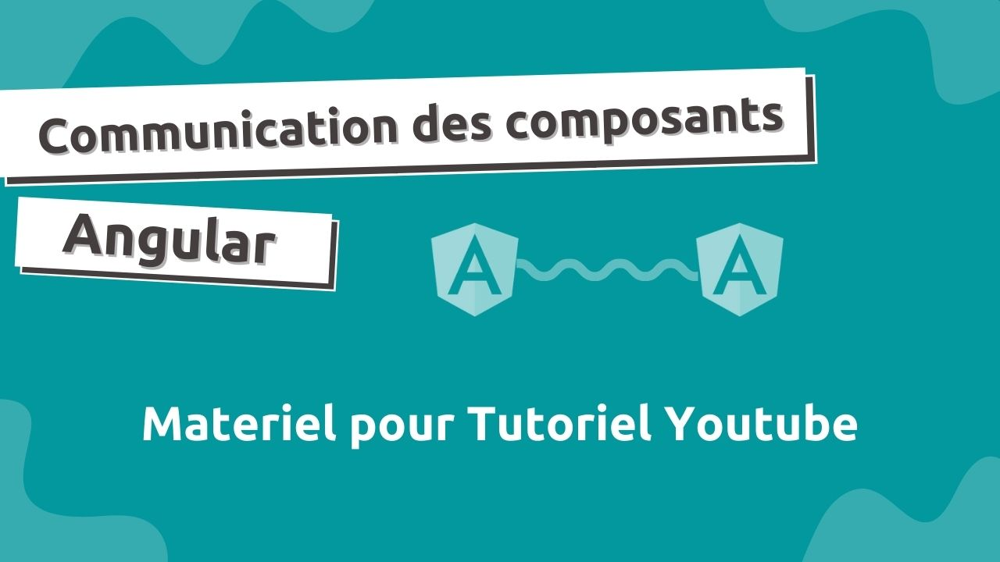

# Tutoriel Communication des composants Angular

- Code source de la serie de tutoriels [Communication des composants Angular](https://www.youtube.com/playlist?list=PLrbLGOB571zeG2gYnVNBsHA_B-OjMNtGv) sur Youtube.

## Usage 

- Sélectioner et Télécharger le contenu de la branche correspondante à la vidéo. 
(ex. partie-1 pour la vidéo 1 de la serie )

- Si une application s'y strouve, installer les dépendences Javascript avec `npm install`

